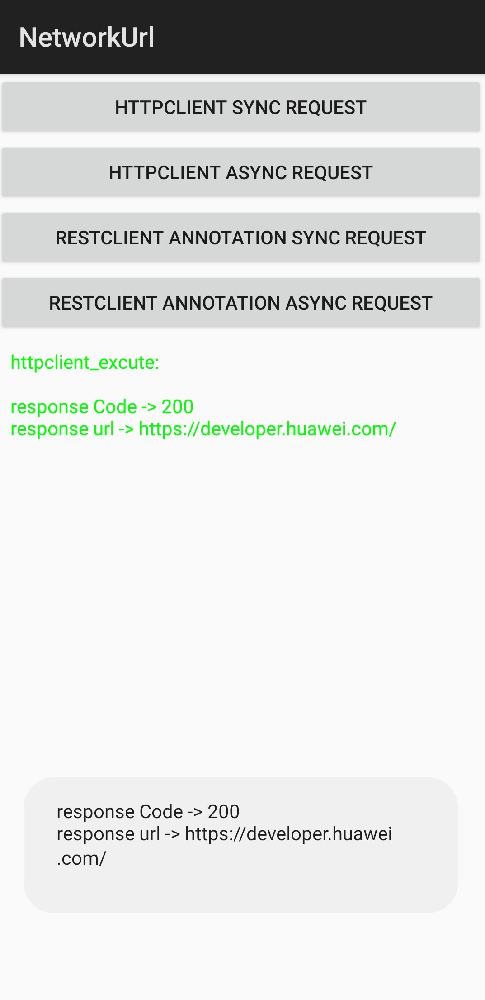

# Sample code for network-url-sample

English |[中文](./README-zh.md)
# Contents

 * [Introduction](#introduction)
 * [Preparations](#preparations)
 * [Environment Requirements](#environment-requirements)
 * [Running Result](#running-result)
 * [License](#license)

## Introduction
   Guided by the sample code for network-url-sample, you will learn how to use Network Kit APIs to interact with the background server. 

## Preparations
   1. Install Android Studio on your computer.
   2. Open the sample project and run the sample code on an Android device.

## Environment Requirements
   1. It is recommended that the Android SDK version be 19 or later, and the JDK version be 1.8 or later.
   2. This version uses new features of Java 8, such as Lambda expressions and static API methods.In this version and later versions, the Java 8 compilation options must be added for the Gradle. Otherwise, UrlConnection will be used to send requests, causing limitations on many request capabilities. The code for adding Java 8 compilation options for Gradle is as follows:
```
   compileOptions {
        sourceCompatibility JavaVersion.VERSION_1_8
        targetCompatibility JavaVersion.VERSION_1_8
   }
```
## Running Result
   

## Technical Support
You can visit the [Reddit community](https://www.reddit.com/r/HuaweiDevelopers/) to learn latest information about HMS Core and communicate with other developers. 

If you have any questions about the sample code, try the following:
- Visit
  [Stack Overflow](https://stackoverflow.com/questions/tagged/huawei-mobile-services)
  and submit your development problem under the `huawei-mobile-services`
  tag. Huawei experts will help you solve the problem in one-to-one
  mode.
- Visit the HMS Core section in the
  [Huawei Developer Forum](https://forums.developer.huawei.com/forumPortal/en/forum/hms-core)
  and communicate with other developers.

If you encounter any issues when using the sample code, submit your
[issues](https://github.com/HMS-Core/hms-network-demo/issues) or submit
a [pull request](https://github.com/HMS-Core/hms-network-demo/pulls).


## License
The sample code is licensed under the [Apache License 2.0](http://www.apache.org/licenses/LICENSE-2.0).
